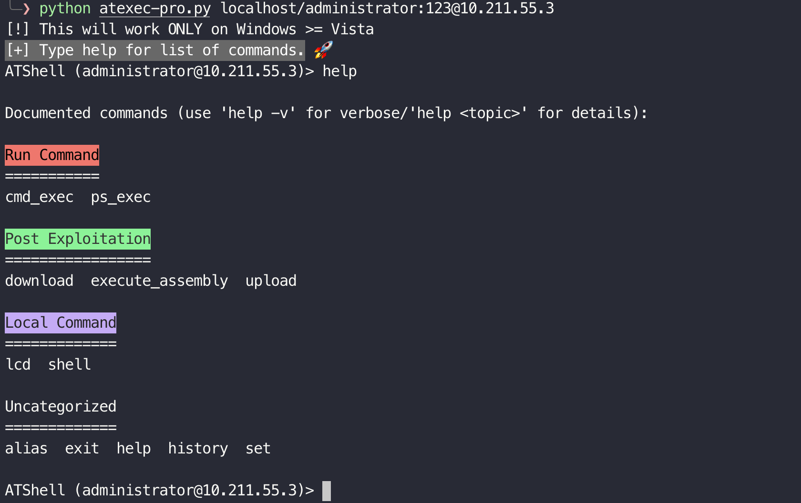
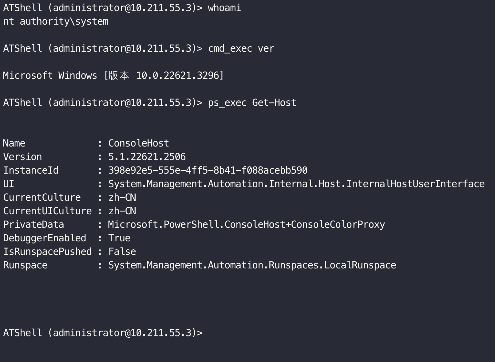
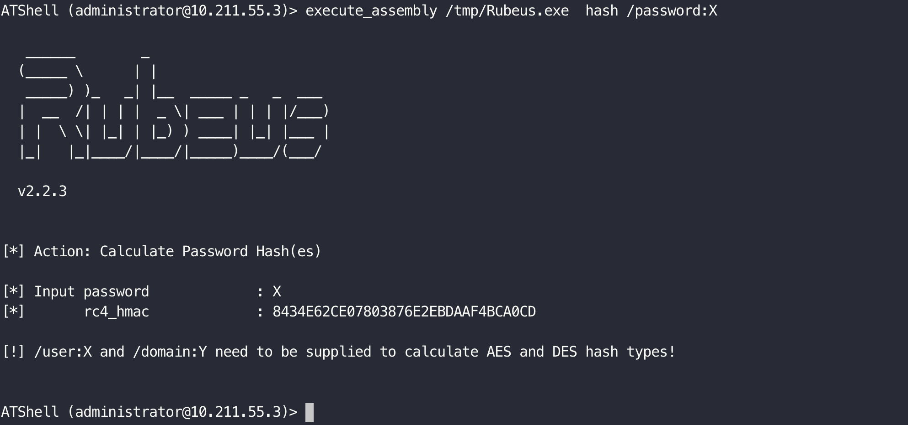
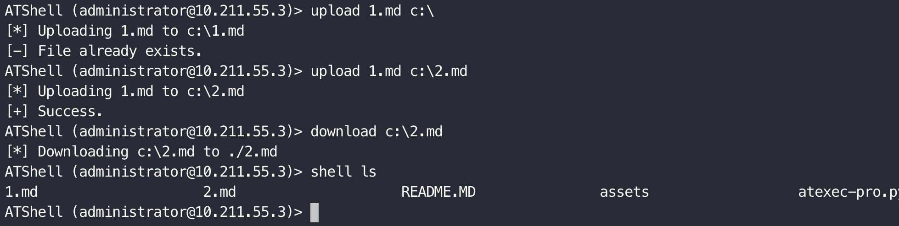

# Atexec-pro

Modified based on [atexec.py](https://github.com/fortra/impacket/blob/master/examples/atexec.py).

The TSCH service is used by default(neet port 135) and port 445 is no longer required.
>ATSVC need port 445

The technology is mainly based on [this article](https://www.zcgonvh.com/post/Advanced_Windows_Task_Scheduler_Playbook-Part.3_from_RPC_to_lateral_movement.html) by [zcgonvh](https://github.com/zcgonvh).

## Features
* CMD command execute
* PS command execute
* File Upload
* File Download
* .Net assembly execute
* Support ATSVC and TSCH interface.
  
>Note: functions `upload`, `download` and `execute-assembly` currently only support files up to `1MB` in size. All functions do not bypass AMSI.

## Usage
```
usage: atexec-pro.py [-h] [-i {TSCH,ATSVC}] [-session-id SESSION_ID] [-ts] [-debug] [-codec CODEC] [-hashes LMHASH:NTHASH] [-no-pass] [-k] [-aesKey hex key]
                     [-dc-ip ip address] [-keytab KEYTAB]
                     target

positional arguments:
  target                [[domain/]username[:password]@]<targetName or address>

options:
  -h, --help            show this help message and exit
  -i {TSCH,ATSVC}, --interface {TSCH,ATSVC}
                        Interface to use.
  -session-id SESSION_ID
                        an existed logon session to use (no output, no cmd.exe)
  -ts                   adds timestamp to every logging output
  -debug                Turn DEBUG output ON
  -codec CODEC          Sets encoding used (codec) from the target's output (default "utf-8"). If errors are detected, run chcp.com at the target, map the result with
                        https://docs.python.org/3/library/codecs.html#standard-encodings and then execute wmiexec.py again with -codec and the corresponding codec

authentication:
  -hashes LMHASH:NTHASH
                        NTLM hashes, format is LMHASH:NTHASH
  -no-pass              don't ask for password (useful for -k)
  -k                    Use Kerberos authentication. Grabs credentials from ccache file (KRB5CCNAME) based on target parameters. If valid credentials cannot be found,
                        it will use the ones specified in the command line
  -aesKey hex key       AES key to use for Kerberos Authentication (128 or 256 bits)
  -dc-ip ip address     IP Address of the domain controller. If omitted it will use the domain part (FQDN) specified in the target parameter
  -keytab KEYTAB        Read keys for SPN from keytab file
```

## example

### GetShell
```
python atexec-pro.py localhost/administrator:123@10.211.55.3
```



### Command



### .Net assembly



### Upload/Download




## References
* [impacket](https://github.com/fortra/impacket)
* [Advanced Windows TaskScheduler Playbook - Part.3 from RPC to lateral movement](https://www.zcgonvh.com/post/Advanced_Windows_Task_Scheduler_Playbook-Part.3_from_RPC_to_lateral_movement.html)
* https://learn.microsoft.com/en-us/openspecs/windows_protocols/ms-tsch/eb12c947-7e20-4a30-a528-85bc433cec44
* https://learn.microsoft.com/en-us/openspecs/windows_protocols/ms-tsch/400d77fe-2f1a-4a8e-a90b-a8f82fad5a20